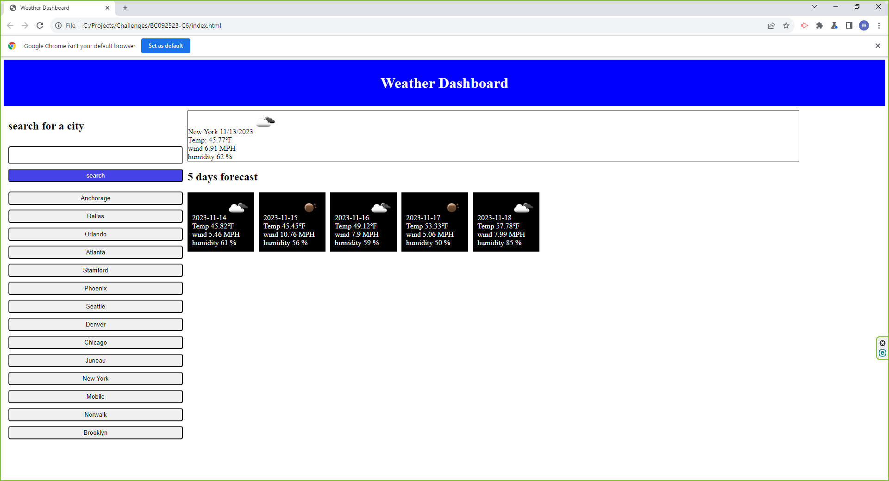

# Server-Side APIs: Weather Dashboard

The 5-Day Weather Forecast App is a user-friendly application created to deliver swift and precise current weather updates and forecasts for the next five days, leveraging the OpenWeather API. Equipped with features such as temperature, humidity, and wind information, the app provides users with a comprehensive overview of upcoming weather conditions. Its intuitive design ensures a seamless user experience, making it easy for users to access and interpret essential weather data.

## Installation

N/A

## Usage

The 5-Day Weather Forecast App effortlessly showcases both the current weather and the extended 5-day forecast for user-input cities. The app boasts a convenient feature that stores a history of previously queried city weather, leveraging the local storage function. This functionality ensures quick access to frequently checked locations and provides users with a seamless and personalized experience. Whether you're planning a trip or simply staying informed about various city climates, the app's intuitive design and history-saving capability enhance usability and make the exploration of weather data a smooth process.

## Credits

## License

Please refer to the LICENSE in the repo.

## Webpage URL

https://wchoi888.github.io/BC092523-C6/

## Screenshot

